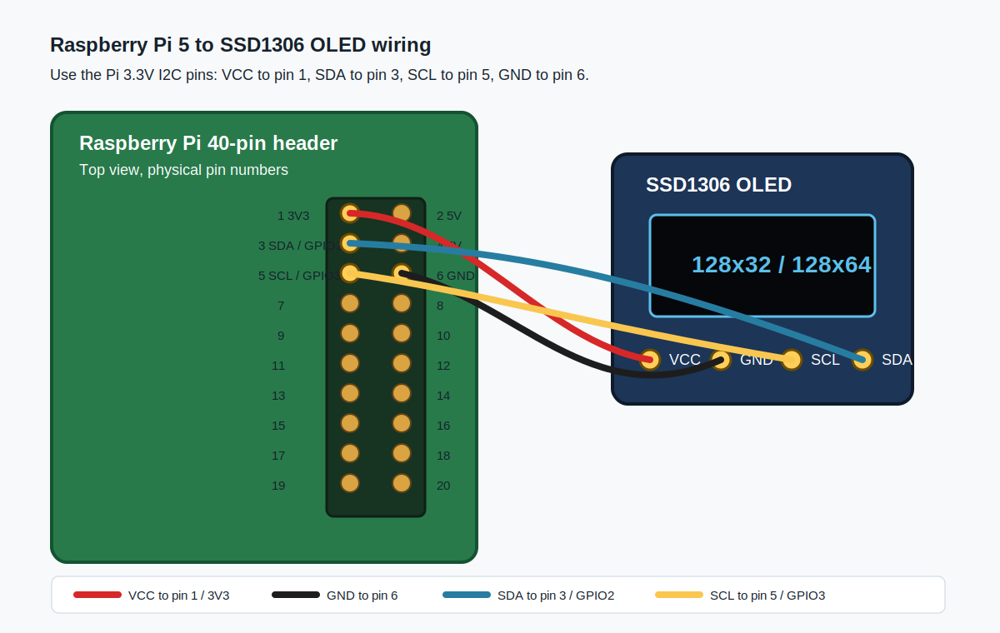

# Raspberry Pi 5 to SSD1306 OLED Wiring

This diagram is for a 4-pin I2C SSD1306 OLED module, either `128x32` or `128x64`.



## Pin Mapping

| OLED pin | Raspberry Pi GPIO | Raspberry Pi physical pin | Notes |
| --- | --- | --- | --- |
| `VCC` | `3V3` | Pin `1` | Use 3.3V, not 5V |
| `GND` | `GND` | Pin `6` | Any Pi ground pin is fine |
| `SDA` | `GPIO 2 / SDA1` | Pin `3` | I2C data |
| `SCL` | `GPIO 3 / SCL1` | Pin `5` | I2C clock |

## Raspberry Pi Header View

This is the Pi header viewed from above, with the USB/Ethernet ports facing away from you.

```text
OLED VCC  ->  Pin 1   3V3      [ 1] [ 2]  5V
OLED SDA  ->  Pin 3   GPIO2    [ 3] [ 4]  5V
OLED SCL  ->  Pin 5   GPIO3    [ 5] [ 6]  GND   <- OLED GND
                         GPIO4 [ 7] [ 8]  GPIO14
                           GND [ 9] [10]  GPIO15
                        GPIO17 [11] [12]  GPIO18
                        GPIO27 [13] [14]  GND
                        GPIO22 [15] [16]  GPIO23
                           3V3 [17] [18]  GPIO24
                        GPIO10 [19] [20]  GND
                         GPIO9 [21] [22]  GPIO25
                        GPIO11 [23] [24]  GPIO8
                           GND [25] [26]  GPIO7
                         GPIO0 [27] [28]  GPIO1
                         GPIO5 [29] [30]  GND
                         GPIO6 [31] [32]  GPIO12
                        GPIO13 [33] [34]  GND
                        GPIO19 [35] [36]  GPIO16
                        GPIO26 [37] [38]  GPIO20
                           GND [39] [40]  GPIO21
```

## I2C Check

After wiring, enable I2C and check the OLED address:

```sh
sudo raspi-config
i2cdetect -y 1
```

Most SSD1306 modules appear at `0x3C`; some appear at `0x3D`.
